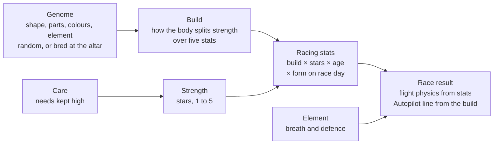

# Dragon genetics, stats & stars

## Overview

A dragon is a fixed genome plus a few things that change with its life: age, strength, bond, care
needs and fatigue. Its racing stats are never stored; they are recomputed from its genome, its
strength and its age whenever needed.

| Question | Short answer | Section |
| --- | --- | --- |
| How are a dragon's looks decided? | Its genome: random for starters, gift and prize eggs, inherited at the Soul Altar, every trait whole from one parent or a mutation, shapes blended. | Looks |
| How are its stats decided? | Five stats, each its build's share times its stars, then × age and × form on race day. | Stats |
| What are stars? | Its strength, 1 to 5, the same scale for every dragon. Care alone raises it. | Stars |
| What slows a dragon in a race? | Missed gates, breath hits, bumps, turns tighter than its Handling and the takeoff; Acceleration brings it back. | Race |
| What do elements do? | Five elements in a cycle: each beats the next and is resisted by the one before. | Elements |

## Looks

A dragon's look is its genome, fixed at hatch and never changed afterwards. Age changes how the
genome is drawn, not the genome itself. Genes are listed in `src/genome/dragon.js`.

| Gene kind | Genes | Values | Affects racing? |
| --- | --- | --- | --- |
| Shape | `body`, `wingspan`, `neck`, `tail`, `horns` (headgear size), `spines` (crest), `legs`, `thighs` | A metre range per gene | `body`, `wingspan`, `neck`, `tail`, `horns` and `thighs` set the build; `legs` the takeoff jump; `spines` none |
| Colour | `scales`, `wings`, `underside` (one of 32 named colours each), `eyes` | A choice | No |
| Part | `head`, `headgear`, `legShape`, `wingFingers`, `feet`, `tailTip`, `hindWings` | A choice | `legShape` sets the takeoff jump; the rest no |
| Element | `breath` (fire, nature, earth, storm, water) | A choice, shown only while breathing | Breath attacks and defence |
| Rare | `metal`: a gold, silver or mixed metallic coat (body, then wings), one dragon in a thousand | A choice | Gold +1.2 Top speed levels, silver +0.9 Acceleration and Handling; a mixed coat half of each |
| Rare | `mane`: from the teen years on, a mane of its breath element in place of its spikes from the tail tip to the forehead, one dragon in 25 | A choice | No |

### Where a genome comes from

1. **Starter kids.** A new stable is offered 3 seeded kids at 1 star, each built for a different stat (`src/stable/starters.js`).
2. **The gift egg.** Adopting a starter gives one egg hatching at 1 star, its seed picked from 48 candidates as the one furthest from the adopted kid (`genomeDistance`: coat colours first, then parts, proportions and build), so the two look and race unlike each other.
3. **Prize eggs.** A podium finish at a season's ceremony wins an egg of a random genome, hatching at 1 to 2.5 stars by division and place (`src/stable/prizeEgg.js`).
4. **Soul Altar eggs.** Two to six adults hold a ritual; it lays an egg 36% of the time with two parents, up to 90% with six (`src/stable/soulAltar.js`).

### Inheritance

Everything a baby shows can be seen on one of its parents, unless it mutated; there are no hidden or
recessive genes (`inheritGenome` in `src/genome/inheritGenome.js`).

- **Parts, element and colours** each come whole from one parent, picked evenly
- **Mutation** rolls a variant no parent shows: 5% when the parents all agree, up to 20% when they all differ (`5% + 15% × (distinct variants − 1) / (parents − 1)`). The lineage screen celebrates it
- **Rare genes** (`metal`, `mane`) never come from a mutation: a baby takes its parent's, or at the gene's own odds (one in a thousand for a metal, one in 25 for a mane) turns up a new one, whatever its parents show
- **Shape** blends: each shape gene is a random weighted average of the parents plus a little noise, so two sprinters make a sprinter

An egg holds one baby, fixed when it is laid or won. It incubates 8 game hours (the gift egg 20 minutes); Warm,
once an hour and at most 4 times, skips an hour each and adds 0.125 stars at hatch. An altar egg hatches at half
its parents' average stars.

## Stats

`deriveStats(subject, genome, age, strength)` in `src/race/deriveStats.js`.

| Stat | In the race | On the body |
| --- | --- | --- |
| **Top speed** | How fast it flies on a clear stretch | A long, sleek torso (`body`) |
| **Acceleration** | How quickly it gets back to top speed; also its climb | Big wings (`wingspan`) |
| **Handling** | How tight it turns without bleeding speed | A long tail (`tail`) |
| **Weight** | Wins bumps, shrugs off knockback, holds speed in dives; a little slower to accelerate | Overall bulk: torso 30%, thighs 25%, neck, tail and headgear 15% each |
| **Breath** | How hard its breath hits and how soon it recharges | Big headgear (`horns`) |

### The build

`buildOf(genes, genome)` in `src/dragonBuild.js` turns the shape genes into five shares averaging 1:
each gene centred on its range moves its stat's share by up to ±0.35, then the shares are normalised,
so two dragons of the same strength have the same total and the build only says where it goes.
`standout` is the stat with the biggest share, what the dragon is built for.

### Levels and flight stats

Each stat's level is its share times the dragon's stars, plus any rare gene's bonus (`statLevels`, `geneBonus`). `flightStats(level)` turns
levels into flight units: top speed and climb in m/s (Froude-scaled), acceleration and handling in
m/s², weight relative, breath a power with its `recharge` in seconds.

### Age and form

Kids fly and accelerate at 82% of an adult, teens at 90%; the other stats do not change with age.
Kids cannot breathe, so their Breath shows greyed. Form is rolled for every starter from the race's
seed (`raceForm` in `src/race/racerTraits.js`): perfect shape (10%) adds 0.5% to Top speed and
Acceleration, off shape (10%) takes 0.5% off, usual (80%) changes nothing. It is shown before the race
on the entry screen, in the commentator's opening lines and as a tag on the dragon in the stable;
tapping the tag explains it. On the game's first day the owner's dragons are always in perfect shape
(`raceDayForm` in `src/stable/raceDayForm.js`).

### What the owner sees

The profile draws the five stats as a radar: the filled shape is the dragon now, its form the build
and its size the stars; the dashed outline is the same build at 5 stars. Each axis has a line naming
the body part behind it.

## Stars

Stars are strength (`src/stable/strength.js`), stored on the dragon as `strength`, 1 to 5 with
fractions. 5 is the same maximum for every dragon, whatever its genes, and every dragon can reach it.

- Each game hour at a care level of 0.75 or more adds 4/72 of a star, less down to nothing at 0.4, so a 1-star hatchling reaches 5 in about three days of good care
- Care level is how well the needs of its age are kept up: kids fed, happy and clean, teens also exercised, adults also groomed
- Strength never goes down; neglect only stops it. It carries through evolution
- Races do not add strength
- A card shows the whole stars filled and the next one outlined while care grows it

Growing up takes time only: a kid becomes a teen after 4 hours and a teen an adult after 8.

## Race

`createRaceSim` in `src/race/raceSim.js`. There is no stamina. A dragon flies at its top speed unless
something slows it:

- A missed gate: it aims a quarter below top speed for 2.5 s
- A breath hit: slowed, knocked back and dazed (see Elements)
- A bump with a rival: speed lost between them, the lighter losing more
- A turn tighter than its Handling bleeds speed
- The takeoff: legs and Weight decide the jump

Acceleration decides how quickly it is back up to speed. Slipstream raises the speed a chaser aims
for by up to 5% and lingers 2 s after it pulls out, slingshotting it past. A clean pass through a
gate's centre gives a small burst.

**Autopilot** (`decide` in `src/race/pilot.js`) flies every racer from what it already is: high
Handling cuts tighter inside lines, high Top speed takes the wide, smooth line, heavy dragons pass
close and light ones go round; it follows a slower rival for the slipstream and detours for thermals.
It breathes as soon as its breath is ready and a rival ahead is in reach, preferring rivals it is
strong against and sparing the ones that resist it. A seeded lane offset and timing per race spreads
the field.

**Riding** is the stick and Breath. The dragon always flies at the pace its stats allow; the rider's
edge is the line (gate centres, slipstream, thermals, smooth turns) and when to breathe.

## Elements

Fire → Nature → Earth → Storm → Water → Fire: each beats the next (×2, "Super effective!"), is
resisted by itself and the one before (×0.5) and lands evenly on the rest (×1). A dragon's element is
its breath and its defence.

| Element | Breath | Beats | Leans on |
| --- | --- | --- | --- |
| Fire | Flame | Nature | Slowdown |
| Nature | Thorns and vines | Earth | Knockback, smaller and longer |
| Earth | Sand and rock | Storm | Knockback |
| Storm | Lightning | Water | Daze |
| Water | Water jet and frost spray | Fire | Slowdown, smaller and longer |

Every hit has the same three effects (`landHit` in `src/race/breathHits.js`), scaled by the
breather's Breath, the matchup and the element's lean:

| Effect | What happens | Softened by |
| --- | --- | --- |
| Slowdown | Aims below top speed for a moment | The target's Acceleration, getting back up to speed |
| Knockback | Shoved back and off its line | The target's Weight |
| Daze | Ignores the stick and the line, under 0.5 s | The target's Handling |

Breath recharges at a rate set by the Breath stat and costs nothing else.
